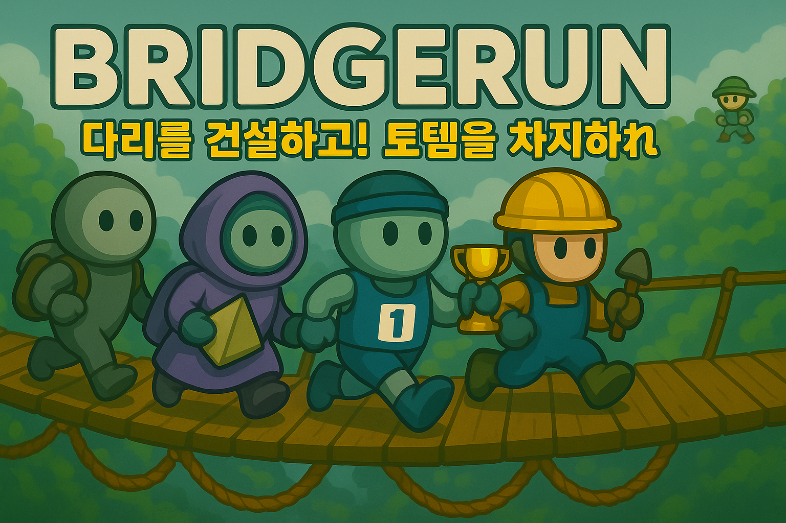

# Game Development Portfolio

  
## 김건우 (Gunwoo Kim)
안녕하세요, 게임 개발자를 꿈꾸는 **김건우**입니다. 이 레포지토리는 제가 참여한 다양한 게임 개발 프로젝트들을 소개하는 포트폴리오입니다. Unreal Engine을 주로 활용하여 개발했으며, 게임 플레이 로직과 시스템 구현에 집중했습니다. 각 프로젝트를 클릭하시면 자세한 내용을 확인하실 수 있습니다.

## 🛠 Skills
- **Game Engine**: Unreal Engine 4/5, Blueprint & C++
- **Programming**: C++, Blueprint Visual Scripting
- **Game Systems**: 물리 기반 캐릭터 컨트롤러, 멀티플레이어 네트워크, 게임플레이 프레임워크
- **Tools**: Visual Studio, Git, GitHub

## 🎮 Game Projects

  <table>
    <tr>
      <td width="50%">
        <a href="https://github.com/genwo123/Y2S3_MISINJEON_CPP">
          
           
          <b>미신전 (未信殿)</b>
           
          숙명여대 디자인학부 졸업전시 협업 프로젝트
           
          UE5 | C++ | 디자이너 3명, 개발자 2명, 사운드 1명
           
          챕터 0: 프롤로그 완성
        </a>
      </td>
      <td width="50%">
        <a href="https://github.com/genwo123/BridgeRun">
          
           
          <b>브릿지런</b>
           
          액션 슈팅 전략 게임 [개발중]
           
          UE5 | 1인 개발 | 물리 기반 | 네트워크
        </a>
      </td>
    </tr>
  </table>

## 💻 Collaboration Projects
### [팅커벨](https://github.com/genwo123/WhatAbout)
AWS 리빙랩 해커톤 대상 수상작 | 2024.08
- 청년층 전세사기 예방과 안전한 주거 계약을 지원하는 AI 기반 통합 솔루션
- AWS 클라우드 기반 서비스 개발

### [UFO's (University Festival Order System)](https://github.com/genwo123/UFOs)
축제 주문 관리 시스템 | 2024.05
- QR 코드 기반
- 대학 축제 주문 & 관리 시스템 개발 

### [너나묵자 (Neonamukja)](https://github.com/genwo123/NNMJ_Project)
배달 커넥팅 앱 | 2022.11
- 기숙사생 배달 파트너 매칭 서비스

### [군장존](https://github.com/genwo123/gunjangzone)
게임 스펙 검사기 | 2024.05
- 웹 기반 RPG 게임 스펙 분석 도구

---

## 📚 Research & Activities
### 스마일게이트 퓨처랩 챌린지
자율적인 퓨처랩 챌린지와 Udemy 강의로 DirectX 렌더링과 언리얼 엔진을 학습했으며, 전투, 장애물, 퍼즐, 슈팅 게임을 제작했습니다.

### 전공동아리 TripleS
- 3년 연속 동아리장 역임 (50명+ 회원 관리)
- 코딩테스트 스터디 그룹 운영
- 프로젝트 기획 및 관리 총괄
- 2년 연속 동아리 공모전 은상 수상

## 🏆 Achievements
- AWS 리빙랩 글로벌 해커톤 대상 (2024.08)
- 연암공과대학교 혁신지원사업 은상 (2024.01)
- 동명대학교 지식재산교육선도대학사업단 우수상 (2023.10)
- 경남소프트웨어경진대회 입선 (2023.11)

## 👥 Team Stories
[토글 형식의 팀 피드백 섹션은 그대로 유지]

개인정보와 이력서 형식을 제외하고, 프로젝트와 활동 중심으로 재구성했습니다. 더 수정이나 보완이 필요한 부분이 있으신가요?
